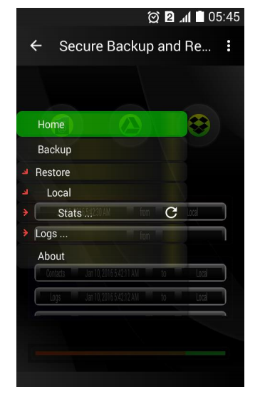
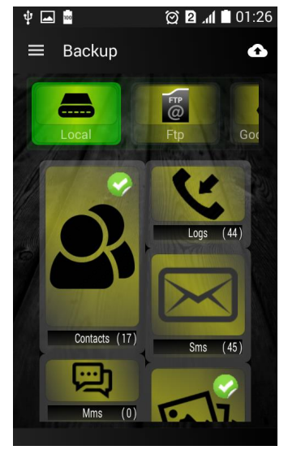
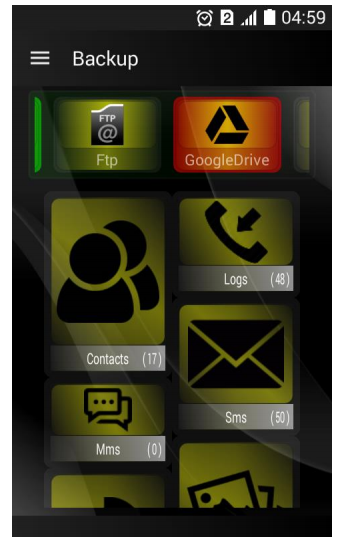
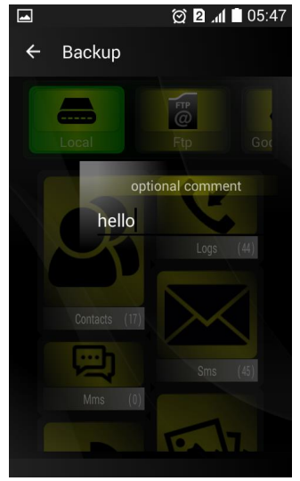
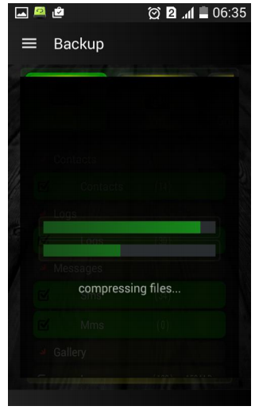
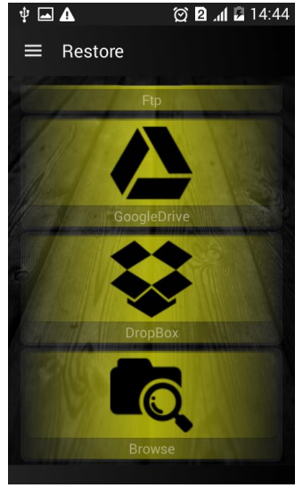
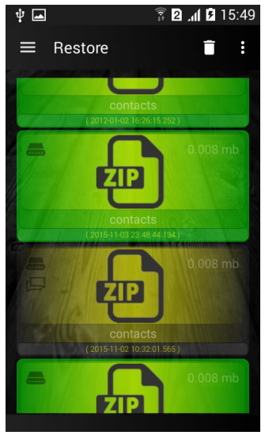
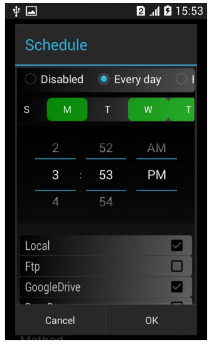

Android app that backs up and restores your 

phone's contacts, messages, calendar, gallery 

(audio, video, images), alarms, bookmarks and 

call logs into a compressed zip file with a user 

defined password to local device storage or to 

a remote online storage service (Drop-box, 

GDrive, FTP), it can backup multi versions of 

selected data, therefor this app contains built-

in file explorer for local device storage and the 

supported online services, there's a lot of 

features that need to be documented, ex: 

backup file's can be deleted in case of device 

lost using sms. * This is my second attempt to 

develop android app's so expect some silly 

code (maybe).

-------------------------------------

 

